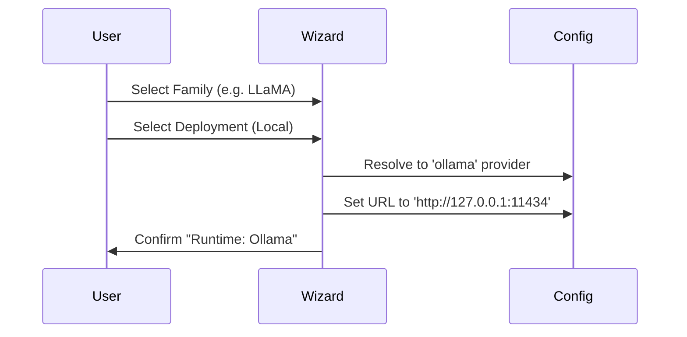

# System Architecture

## Overview
Moth is a local, LLM-agnostic code intelligence CLI. It acts as an orchestrator between the user, the filesystem, and various LLM providers.

## High-Level Architecture

```mermaid
graph TD
    User[User] -->|Commands/Prompts| CLI[CLI Entry Point (index.ts)]
    CLI --> UI[UI Layer (Ink)]
    CLI --> Config[Config Manager]
    UI --> App[App Component]
    App --> Orch[Agent Orchestrator]
    Orch --> Tools[Tool Registry]
    Orch --> LLM[LLM Client]
    
    subgraph Core Logic
    Orch
    Tools
    end
    
    subgraph Infrastructure
    Config
    LLM
    FS[File System]
    end
    
    Tools --> FS
    LLM -->|API Calls| Cloud[Cloud Providers (OpenAI/Gemini/Claude)]
    LLM -->|Local| Local[Ollama/LocalHost]
```

## Component Interaction

### Chat Session Flow
1.  **Initialization**: `startChatSession()` in `index.ts` loads configuration and mounts the `App` component.
2.  **Input**: User types a prompt.
3.  **App State**: `App.tsx` captures the input and appends it to the `messages` history.
4.  **Orchestration**: `App.tsx` calls `orchestrator.run(prompt, history)`.
5.  **Agent Loop**:
    *   **System Prompt**: Constructed with available tools.
    *   **LLM Call**: History + System Prompt + User Prompt sent to LLM.
    *   **Reasoning**: LLM returns a JSON `AgentStep` (Thought + ToolCall/FinalAnswer).
    *   **Execution**: If ToolCall, `ToolRegistry` executes the tool (e.g., `write_to_file`).
    *   **Recursion**: Output is fed back to LLM until `finalAnswer` is reached.
6.  **Render**: `App.tsx` updates the UI with the stream or final result.

### LLM Provider Resolution
The system uses a **Model-First** pattern to resolve providers:


